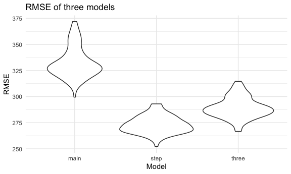
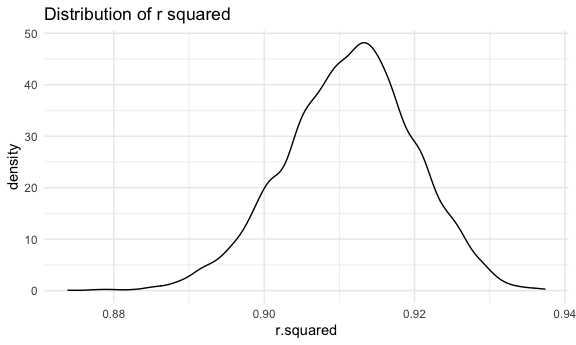

Homework 6
================
Danyang Gui

### Problem 1

``` r
homicide_df = 
  read_csv("data/homicide-data.csv", na = c("", "NA", "Unknown")) %>% 
  mutate(
    city_state = str_c(city, state, sep = ", "),
    victim_age = as.numeric(victim_age),
    resolution = case_when(
      disposition == "Closed without arrest" ~ 0,
      disposition == "Open/No arrest"        ~ 0,
      disposition == "Closed by arrest"      ~ 1)
  ) %>% 
  filter(
    victim_race %in% c("White", "Black"),
    city_state != "Tulsa, AL") %>% 
  select(city_state, resolution, victim_age, victim_race, victim_sex)
```

    ## Parsed with column specification:
    ## cols(
    ##   uid = col_character(),
    ##   reported_date = col_double(),
    ##   victim_last = col_character(),
    ##   victim_first = col_character(),
    ##   victim_race = col_character(),
    ##   victim_age = col_double(),
    ##   victim_sex = col_character(),
    ##   city = col_character(),
    ##   state = col_character(),
    ##   lat = col_double(),
    ##   lon = col_double(),
    ##   disposition = col_character()
    ## )

Start with one city.

``` r
baltimore_df =
  homicide_df %>% 
  filter(city_state == "Baltimore, MD")
glm(resolution ~ victim_age + victim_race + victim_sex, 
    data = baltimore_df,
    family = binomial()) %>% 
  broom::tidy() %>% 
  mutate(
    OR = exp(estimate),
    CI_lower = exp(estimate - 1.96 * std.error),
    CI_upper = exp(estimate + 1.96 * std.error)
  ) %>% 
  select(term, OR, starts_with("CI")) %>% 
  knitr::kable(digits = 3)
```

| term              |    OR | CI\_lower | CI\_upper |
| :---------------- | ----: | --------: | --------: |
| (Intercept)       | 1.363 |     0.975 |     1.907 |
| victim\_age       | 0.993 |     0.987 |     1.000 |
| victim\_raceWhite | 2.320 |     1.648 |     3.268 |
| victim\_sexMale   | 0.426 |     0.325 |     0.558 |

Try this across cities.

``` r
models_results_df = 
  homicide_df %>% 
  nest(data = -city_state) %>% 
  mutate(
    models = 
      map(.x = data, ~glm(resolution ~ victim_age + victim_race + victim_sex, data = .x, family = binomial())),
    results = map(models, broom::tidy)
  ) %>% 
  select(city_state, results) %>% 
  unnest(results) %>% 
  mutate(
    OR = exp(estimate),
    CI_lower = exp(estimate - 1.96 * std.error),
    CI_upper = exp(estimate + 1.96 * std.error)
  ) %>% 
  select(city_state, term, OR, starts_with("CI")) 
```

``` r
models_results_df %>% 
  filter(term == "victim_sexMale") %>% 
  mutate(city_state = fct_reorder(city_state, OR)) %>% 
  ggplot(aes(x = city_state, y = OR)) + 
  geom_point() + 
  geom_errorbar(aes(ymin = CI_lower, ymax = CI_upper)) + 
  theme(axis.text.x = element_text(angle = 90, hjust = 1))
```


### Problem 2

``` r
bwt_df =
  read_csv("./data/birthweight.csv") %>% 
  janitor::clean_names() %>% 
  drop_na() %>% 
  mutate(
    babysex = as.factor(babysex),
    frace = as.factor(frace),
    mrace = as.factor(mrace),
    malform = as.factor(malform)
  ) %>% 
  mutate(
    babysex = case_when(babysex == 1 ~ "male",
                        babysex == 2 ~ "female"),
    malform = case_when(malform == 0 ~ "absent",
                        malform == 1 ~ "present"),
    frace = case_when(frace == 1 ~ "White", 
                      frace == 2 ~ "Black", 
                      frace == 3 ~ "Asian", 
                      frace == 4 ~ "Puerto_Rican", 
                      frace == 8 ~ "Other"),
    mrace = case_when(mrace == 1 ~ "White", 
                      mrace == 2 ~ "Black", 
                      mrace == 3 ~ "Asian", 
                      mrace == 4 ~ "Puerto_Rican"))
```

    ## Parsed with column specification:
    ## cols(
    ##   .default = col_double()
    ## )

    ## See spec(...) for full column specifications.

### Model 1:

I used stepwise regression. The ‘stepAIC’ function also helps to choose
the best model.’stepAIC’ uses AIC criterion and tries to find the model
with the lowest AIC value. We ended up with a model predicted by 11
covariates including babysex, bhead, blength, delwt, fincome, gaweeks,
mheight, mrace, parity, ppwt, and smoken.

``` r
library(MASS)
```

    ## 
    ## Attaching package: 'MASS'

    ## The following object is masked from 'package:dplyr':
    ## 
    ##     select

``` r
library(leaps)
full_model = lm(bwt ~., data = bwt_df)
stepwise_mod = stepAIC(full_model, direction = "backward", trace = FALSE)
summary(stepwise_mod)
```

    ## 
    ## Call:
    ## lm(formula = bwt ~ babysex + bhead + blength + delwt + fincome + 
    ##     gaweeks + mheight + mrace + parity + ppwt + smoken, data = bwt_df)
    ## 
    ## Residuals:
    ##      Min       1Q   Median       3Q      Max 
    ## -1097.18  -185.52    -3.39   174.14  2353.44 
    ## 
    ## Coefficients:
    ##                     Estimate Std. Error t value Pr(>|t|)    
    ## (Intercept)       -6145.1507   141.9496 -43.291  < 2e-16 ***
    ## babysexmale         -28.5580     8.4549  -3.378 0.000737 ***
    ## bhead               130.7770     3.4466  37.944  < 2e-16 ***
    ## blength              74.9471     2.0190  37.120  < 2e-16 ***
    ## delwt                 4.1067     0.3921  10.475  < 2e-16 ***
    ## fincome               0.3180     0.1747   1.820 0.068844 .  
    ## gaweeks              11.5925     1.4621   7.929 2.79e-15 ***
    ## mheight               6.5940     1.7849   3.694 0.000223 ***
    ## mraceBlack          -63.9057    42.3663  -1.508 0.131523    
    ## mracePuerto_Rican   -25.7914    45.3502  -0.569 0.569578    
    ## mraceWhite           74.8868    42.3146   1.770 0.076837 .  
    ## parity               96.3047    40.3362   2.388 0.017004 *  
    ## ppwt                 -2.6756     0.4274  -6.261 4.20e-10 ***
    ## smoken               -4.8434     0.5856  -8.271  < 2e-16 ***
    ## ---
    ## Signif. codes:  0 '***' 0.001 '**' 0.01 '*' 0.05 '.' 0.1 ' ' 1
    ## 
    ## Residual standard error: 272.3 on 4328 degrees of freedom
    ## Multiple R-squared:  0.7181, Adjusted R-squared:  0.7173 
    ## F-statistic: 848.1 on 13 and 4328 DF,  p-value: < 2.2e-16

``` r
plot_model_1 = 
  bwt_df %>% 
  modelr::add_residuals(stepwise_mod) %>% 
  modelr::add_predictions(stepwise_mod) %>% 
  ggplot(aes(x = pred, y = resid)) +
  geom_point(alpha = 0.3) +
  labs(
    title = "Residuals versus Fitted value plot for Model 1",
    x = "Predictor",
    y = "Residual"
  )
  
plot_model_1 
```


### Model 2: length at birth and gestational age as predictors

``` r
main_only_mod = lm(bwt ~ blength + gaweeks, data = bwt_df)
summary(main_only_mod)
```

    ## 
    ## Call:
    ## lm(formula = bwt ~ blength + gaweeks, data = bwt_df)
    ## 
    ## Residuals:
    ##     Min      1Q  Median      3Q     Max 
    ## -1709.6  -215.4   -11.4   208.2  4188.8 
    ## 
    ## Coefficients:
    ##              Estimate Std. Error t value Pr(>|t|)    
    ## (Intercept) -4347.667     97.958  -44.38   <2e-16 ***
    ## blength       128.556      1.990   64.60   <2e-16 ***
    ## gaweeks        27.047      1.718   15.74   <2e-16 ***
    ## ---
    ## Signif. codes:  0 '***' 0.001 '**' 0.01 '*' 0.05 '.' 0.1 ' ' 1
    ## 
    ## Residual standard error: 333.2 on 4339 degrees of freedom
    ## Multiple R-squared:  0.5769, Adjusted R-squared:  0.5767 
    ## F-statistic:  2958 on 2 and 4339 DF,  p-value: < 2.2e-16

### Model 3: head circumference, length, sex, and all interactions (including the three-way interaction)

``` r
three_inter_mod = lm(bwt ~ bhead * blength * babysex, data = bwt_df)
summary(three_inter_mod)
```

    ## 
    ## Call:
    ## lm(formula = bwt ~ bhead * blength * babysex, data = bwt_df)
    ## 
    ## Residuals:
    ##      Min       1Q   Median       3Q      Max 
    ## -1132.99  -190.42   -10.33   178.63  2617.96 
    ## 
    ## Coefficients:
    ##                             Estimate Std. Error t value Pr(>|t|)    
    ## (Intercept)                -801.9487  1102.3077  -0.728 0.466948    
    ## bhead                       -16.5975    34.0916  -0.487 0.626388    
    ## blength                     -21.6460    23.3720  -0.926 0.354421    
    ## babysexmale               -6374.8684  1677.7669  -3.800 0.000147 ***
    ## bhead:blength                 3.3244     0.7126   4.666 3.17e-06 ***
    ## bhead:babysexmale           198.3932    51.0917   3.883 0.000105 ***
    ## blength:babysexmale         123.7729    35.1185   3.524 0.000429 ***
    ## bhead:blength:babysexmale    -3.8781     1.0566  -3.670 0.000245 ***
    ## ---
    ## Signif. codes:  0 '***' 0.001 '**' 0.01 '*' 0.05 '.' 0.1 ' ' 1
    ## 
    ## Residual standard error: 287.7 on 4334 degrees of freedom
    ## Multiple R-squared:  0.6849, Adjusted R-squared:  0.6844 
    ## F-statistic:  1346 on 7 and 4334 DF,  p-value: < 2.2e-16

### Cross-validation

``` r
cv_df =
  crossv_mc(bwt_df, 100) %>% 
  mutate(
    train = map(train, as_tibble),
    test = map(test, as_tibble))
```

``` r
cv_df = 
  cv_df %>% 
  mutate(
    main_mod  = map(train, ~lm(bwt ~ blength + gaweeks, data = .x)),
    three_mod = map(train, ~lm(bwt ~ bhead * blength * babysex, data = .x)),
    step_mod  = map(train, ~lm(bwt ~ babysex + bhead + blength + delwt + fincome + 
                      gaweeks + mheight + mrace + parity + ppwt + smoken, data = .x))) %>% 
  mutate(
    rmse_main = map2_dbl(main_mod, test, ~rmse(model = .x, data = .y)),
    rmse_three = map2_dbl(three_mod, test, ~rmse(model = .x, data = .y)),
    rmse_step = map2_dbl(step_mod, test, ~rmse(model = .x, data = .y)))
```

``` r
cv_df %>%
  dplyr::select(starts_with("rmse")) %>% 
  pivot_longer(
    everything(),
    names_to = "model",
    values_to = "rmse",
    names_prefix = "rmse_"
  ) %>% 
  ggplot(aes(x = model, y = rmse)) +
  geom_violin() +
  labs(
    title = "RMSE of three models",
    x = "Model",
    y = "RMSE"
  )
```



The rmse plots shows that the model generated by stepwise method has the
lowest RMSE.

### Problem 3

``` r
weather_df = 
  rnoaa::meteo_pull_monitors(
    c("USW00094728"),
    var = c("PRCP", "TMIN", "TMAX"), 
    date_min = "2017-01-01",
    date_max = "2017-12-31") %>%
  mutate(
    name = recode(id, USW00094728 = "CentralPark_NY"),
    tmin = tmin / 10,
    tmax = tmax / 10) %>%
  dplyr::select(name, id, everything())
```

    ## Registered S3 method overwritten by 'hoardr':
    ##   method           from
    ##   print.cache_info httr

    ## using cached file: /Users/apple/Library/Caches/R/noaa_ghcnd/USW00094728.dly

    ## date created (size, mb): 2020-10-08 01:50:33 (7.525)

    ## file min/max dates: 1869-01-01 / 2020-10-31

``` r
set.seed(1)
boot_results =
  weather_df %>% 
  bootstrap(n = 5000, id = "strap_id") %>% 
  mutate(
    models = map(strap, ~lm(tmax ~ tmin, data = .x)),
    results_tidy = map(models, broom::tidy),
    results_glance = map(models, broom::glance)
  ) %>% 
  unnest(results_tidy, results_glance) %>% 
  dplyr::select(strap_id, term, estimate, r.squared)
```

    ## Warning: unnest() has a new interface. See ?unnest for details.
    ## Try `df %>% unnest(c(results_tidy, results_glance))`, with `mutate()` if needed

### Distribution of r squared

``` r
estimate_rsquared = 
  boot_results %>% 
  ggplot(aes(x = r.squared)) +
  geom_density() +
  labs(
    title = "Distribution of r squared")
  
estimate_rsquared
```



The distribution of r squared is relatively a normal distribution which
is a little heavier left-tail. It is centered around 0.91 which suggests
a high goodness-of-fit.

### Distribution of log(b0\*b1)

``` r
log_df = 
  boot_results %>% 
  pivot_wider(
    names_from = term, 
    values_from = estimate) %>% 
  rename(intercept = `(Intercept)`) %>% 
  mutate(
    log_b0_times_b1 = log(tmin * intercept)
  )
  
estimate_log = 
  log_df %>% 
  ggplot(aes(x = log_b0_times_b1)) +
  geom_density() +
  labs(
    title = "Distribution of log(b0*b1)")
  
estimate_log
```


The distribution of log(b0\*b1) is relatively a normal distribution
which is centered around 2.01.

### 95% Confidence Interval for r squared

``` r
boot_results %>% 
  distinct(strap_id, r.squared) %>%
  summarise(lower = quantile(r.squared, 0.025),
            upper = quantile(r.squared, 0.975)) %>%
  knitr::kable(caption = "95% Confidence Interval for R squared")
```

|     lower |    upper |
| --------: | -------: |
| 0.8936684 | 0.927106 |

95% Confidence Interval for R squared

The 95% Confidence Interval for R squared is (0.894, 0.927)

### 95% Confidence interval for log(b0\*b1)

``` r
log_df %>% 
  distinct(strap_id, log_b0_times_b1) %>%
  summarise(lower = quantile(log_b0_times_b1, 0.025),
            upper = quantile(log_b0_times_b1, 0.975)) %>%
  knitr::kable(caption = "95% Confidence Interval for log(b0*b1)")
```

|    lower |    upper |
| -------: | -------: |
| 1.964949 | 2.058887 |

95% Confidence Interval for log(b0\*b1)

The 95% Confidence Interval for log(b0\*b1) is (1.965, 2.059)
